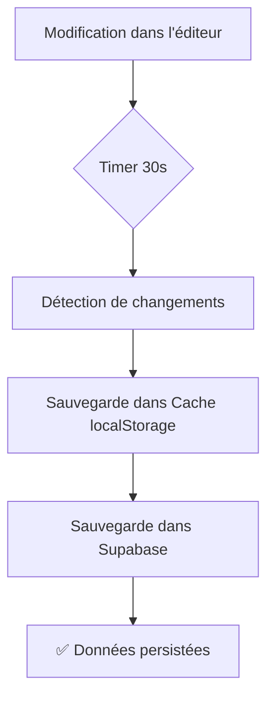
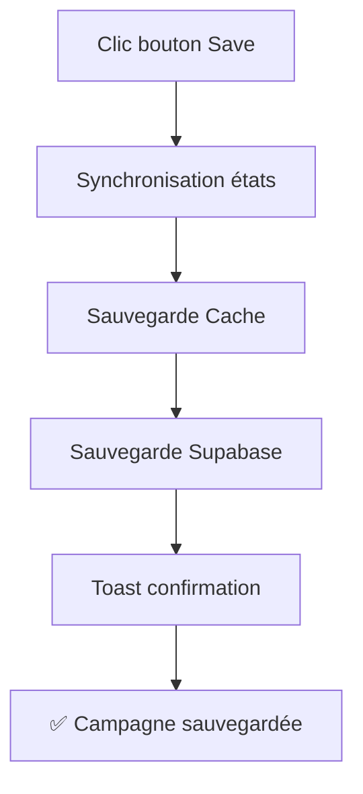
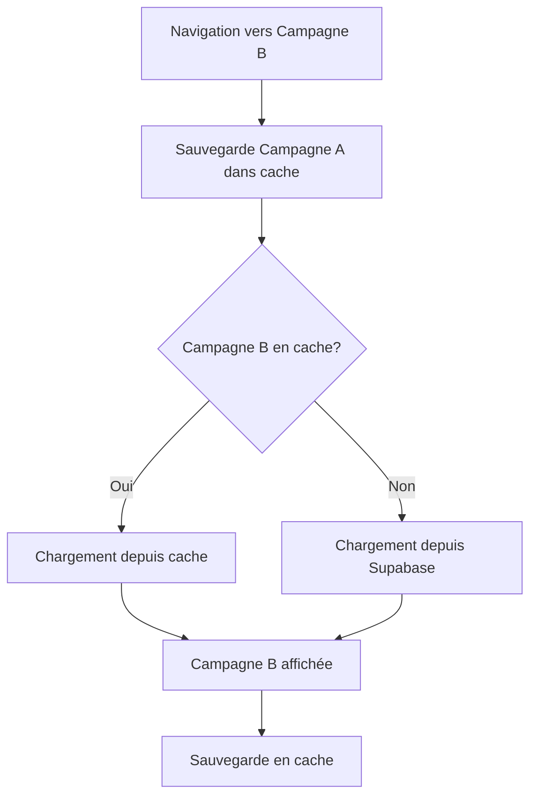

# Système de Sauvegarde Automatique Renforcé

## 🎯 Architecture de Persistance

### 1. **Supabase = Source de Vérité Permanente**

Toutes les données sont automatiquement sauvegardées dans Supabase :

#### Données Sauvegardées
- ✅ Configuration de la campagne (`config`)
- ✅ Éléments canvas (`canvasElements`)
- ✅ Modules par écran (`modularPage`)
- ✅ **Images de fond par écran** (`screenBackgrounds`)
  - Screen 1 (écran de jeu)
  - Screen 2 (formulaire de contact)
  - Screen 3 (message de sortie)
- ✅ Zoom et device actuel
- ✅ Design et couleurs
- ✅ Configuration du jeu (`gameConfig`)

#### Sauvegarde des Images
Les images uploadées sont stockées dans deux endroits :

1. **Supabase Storage** (`campaign-assets` bucket)
   - Stockage permanent des fichiers images
   - URLs générées automatiquement
   - Accessibles publiquement

2. **Base de données Supabase**
   - URLs des images sauvegardées dans `campaigns.config.canvasConfig.screenBackgrounds`
   - Structure par écran et par device :
   ```json
   {
     "screen1": {
       "type": "image",
       "value": "https://vmkwascgjntopgkbmctv.supabase.co/storage/v1/object/public/campaign-assets/..."
     },
     "screen2": { ... },
     "screen3": { ... }
   }
   ```

### 2. **localStorage = Cache de Performance**

Cache temporaire pour améliorer les performances :

- ⚡ Chargement instantané lors du changement de campagne
- ⚡ Évite les requêtes réseau répétées
- 🧹 Nettoyage automatique après 7 jours
- 🔄 Se synchronise avec Supabase

#### Namespace par Campagne
Chaque campagne a son propre namespace :
```
campaign_<uuid>:editorCache
campaign_<uuid>:bg-desktop-screen1
campaign_<uuid>:bg-mobile-screen2
...
```

## 🔄 Flux de Sauvegarde

### Auto-Save Toutes les 30 Secondes



### Sauvegarde Manuelle



### Changement de Campagne



## 🛡️ Garanties de Persistance

### Upload d'Images
1. **Upload vers Supabase Storage**
   - L'image est uploadée dans le bucket `campaign-assets`
   - Une URL publique permanente est générée
   
2. **Sauvegarde de l'URL**
   - L'URL est immédiatement ajoutée à `screenBackgrounds`
   - Auto-save déclenché après 30s maximum
   - Sauvegarde manuelle possible via bouton Save

3. **Vérification**
   - L'URL est stockée dans `campaigns.config.canvasConfig.screenBackgrounds`
   - L'URL est aussi dans `campaigns.design.backgroundImage` (écran 1)
   - Doublement sécurisé pour la compatibilité

### Isolation par Campagne
- Chaque campagne a son propre cache localStorage
- Pas de pollution de données entre campagnes
- Nettoyage automatique des anciennes campagnes

## 📋 Checklist de Persistance

Pour vérifier qu'une campagne est bien sauvegardée :

### 1. Vérifier dans l'Interface
```javascript
// Dans la console du navigateur
console.log('Campaign State:', useEditorStore.getState().campaign)
console.log('Canvas Elements:', canvasElements)
console.log('Screen Backgrounds:', screenBackgrounds)
```

### 2. Vérifier dans Supabase
```sql
-- Voir la campagne avec tous ses détails
SELECT 
  id, 
  name,
  config->'canvasConfig'->'screenBackgrounds' as screen_backgrounds,
  design->'backgroundImage' as bg_image
FROM campaigns 
WHERE id = '<campaign-id>';
```

### 3. Vérifier dans localStorage
```javascript
// Dans la console du navigateur
Object.keys(localStorage)
  .filter(key => key.startsWith('campaign_'))
  .forEach(key => console.log(key, localStorage.getItem(key)))
```

## 🔧 Configuration

### Modifier l'intervalle d'auto-save

Dans `src/components/QuizEditor/DesignEditorLayout.tsx` :

```typescript
useAutoSaveToSupabase(
  { campaign, canvasElements, modularPage, screenBackgrounds, canvasZoom },
  {
    enabled: true,
    interval: 30000, // Changer ici (en millisecondes)
    onSave: () => { console.log('✅ Auto-saved') },
    onError: (error) => { console.error('❌ Error:', error) }
  }
);
```

### Désactiver l'auto-save

```typescript
useAutoSaveToSupabase(
  { /* ... */ },
  {
    enabled: false, // Désactiver ici
    interval: 30000
  }
);
```

## 🐛 Debugging

### Logs de Sauvegarde

Tous les logs sont préfixés :
- `💾 [AutoSave]` - Sauvegarde automatique
- `📦 [QuizEditor]` - Chargement de campagne
- `🔄 [EditorStore]` - Opérations sur le store
- `💾 [CampaignStorage]` - Opérations localStorage

### Vérifier une sauvegarde

1. Ouvrir DevTools Console
2. Chercher les logs `✅ [AutoSave] Campaign saved successfully`
3. Vérifier que l'ID correspond à votre campagne

### Forcer une sauvegarde

```javascript
// Dans la console
const store = useEditorStore.getState();
store.saveToCampaignCache('<campaign-id>', {
  campaign: store.campaign,
  canvasElements: [],
  modularPage: {},
  screenBackgrounds: {}
});
```

## 📚 Fichiers Concernés

- `src/hooks/useAutoSaveToSupabase.ts` - Hook d'auto-save
- `src/utils/campaignStorage.ts` - Gestion localStorage
- `src/hooks/useCampaignCleanup.ts` - Nettoyage automatique
- `src/stores/editorStore.ts` - Store avec cache
- `src/components/QuizEditor/DesignEditorLayout.tsx` - Intégration
- `src/hooks/useModernCampaignEditor/saveHandler.ts` - Sauvegarde Supabase

## 🎉 Résultat

**Vous ne perdrez plus jamais vos données** :
- ✅ Sauvegarde automatique toutes les 30s
- ✅ Cache local pour performance
- ✅ Images de fond persistées
- ✅ Isolation complète par campagne
- ✅ Nettoyage automatique
- ✅ Double sécurité (cache + DB)
